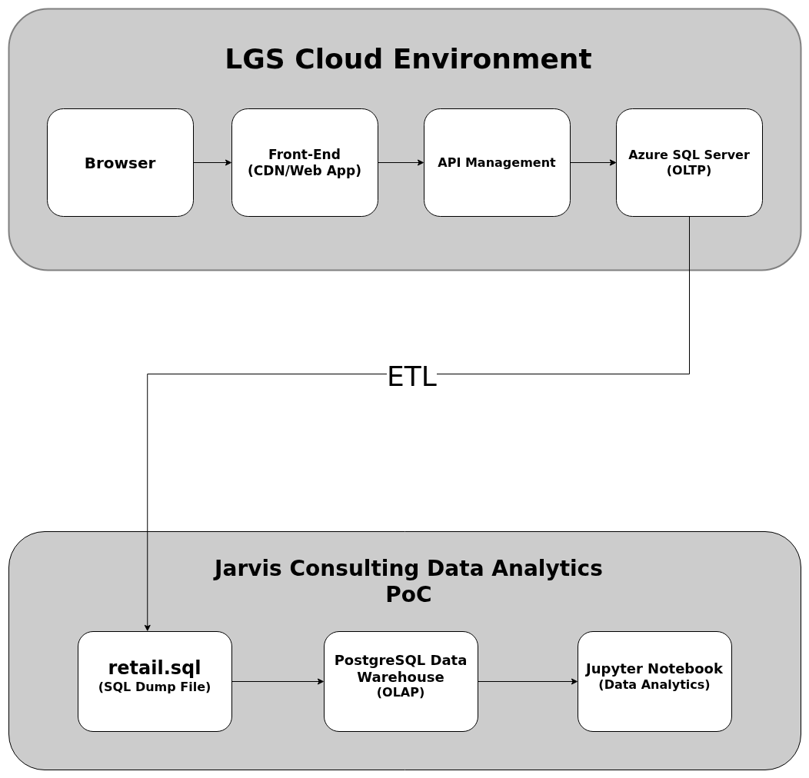

# Python Data Analytics  London Gift Shop (LGS)

## Introduction

London Gift Shop (LGS) is a UK-based online retailer whose revenue growth has stagnated despite operating for more than a decade. The marketing team wants to leverage historical transaction data to better understand customer purchasing behavior and improve sales performance. As part of a Proof of Concept (PoC), this project analyzes retail transaction data to generate business insights that support targeted marketing campaigns and revenue optimization. The analysis was conducted using Python, Pandas, NumPy, PostgreSQL, and Jupyter Notebook.

---

## Implementation

### Project Architecture

The LGS online system consists of a front-end application connected to an API layer and an Azure SQL OLTP database. Transaction data is extracted via an ETL process and shared as a SQL dump file for analytics purposes. The data is then loaded into a PostgreSQL data warehouse environment where analytical queries and data wrangling are performed. Jupyter Notebook is used as the analytics layer to clean, transform, and analyze the dataset to generate actionable insights.

---

### Data Analytics and Wrangling

The data analysis process is implemented in the following Jupyter Notebook:

[Retail Data Analytics Notebook](./retail_data_analytics_wrangling.ipynb)

The dataset includes invoice information, product codes, quantities, pricing, customer identifiers, and country-level data. Data cleaning steps include handling cancellations, removing missing customer IDs, and filtering invalid transactions. Aggregations were performed to identify top-selling products, revenue trends, customer purchasing frequency, and geographic performance. These insights can help LGS design targeted promotions, improve inventory decisions, and implement data-driven marketing strategies.

---

## Improvements

If given more time, this project could be enhanced by implementing automated ETL pipelines to refresh data regularly. Additionally, interactive dashboards using tools like Power BI or Streamlit could be developed for real-time visualization. Finally, predictive modeling techniques such as sales forecasting or customer segmentation could be introduced to further optimize marketing strategies.
